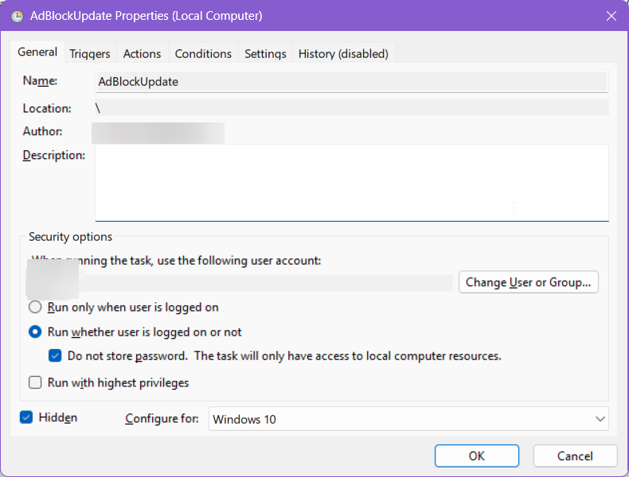

<div align="center">

# HostlistDownloader

A basic utility for Windows and Linux designed for users to download multiple host files from remote URLs, remove empty lines and comments, and consolidate them into a single combined blocklist/whitelist file. Perfect for services like Portmaster.

[](https://github.com/lloyd99901/HostlistDownloader/issues)
[](https://github.com/lloyd99901/HostlistDownloader/stargazers)
[](/LICENSE)

<br/>
<hr>

## Core Capabilities

HostlistDownloader streamlines hostlists by automatically fetching lists from remote sources that the user configures and merging them into one combined-blocklist/whitelist file.

| Feature | Description |
| :--- | :--- |
| **Automated Data Fetching** | Downloads raw host files directly from all configured URLs defined within the `settings.json` file. |
| **Smart Update Checking** | Checks for updates using HTTP eTags to ensure only fresh versions of host files are downloaded, saving bandwidth and time. |
| **Multi-Threaded Downloads** | Utilizes customizable multi-threaded downloading to process and fetch numerous hostfiles quickly. |
| **Data Cleaning & Merging** | Automatically strips out empty lines, comments (`#`, `;`), and detects/removes duplicate entries during consolidation. |
| **Format Flexibility** | Forces a specific output format on all downloaded files (e.g., `hosts` file standard, IP-only, domain list, DNSMasq). |
| **Customization** | Allows combining pre-existing user-defined blocklists or whitelists with the automatically downloaded lists. |

<hr>

# How to Configure and Use

The primary configuration method involves defining your source URLs and required parameters in the `settings.json` file. This centralized system ensures clear management of all input sources, whether they are general blocklists, specific whitelists, or custom user domains.

### Step-by-Step Setup Guide
1.  **Initial Run:** Run HostlistDownloader once. This process will create a default, template `settings.json` file for you.
2.  **Editing Settings:** Open and edit the `settings.json`. Add or modify the desired URLs of your host lists (separate multiple URLs with new lines). You can also adjust global settings like format type, maximum download threads, or log expiry period.
3.  **Execution:** Run HostlistDownloader again. It will automatically detect the new sources, download the updated host lists, and generate the final combined output file (`HLDcombined-...txt`), fully cleaned of duplicates and comments.

#### Running Scheduled Tasks (Silent Operation):
To configure a task schedule to run silently, set up the task using the following settings: "Run whether user is logged on or not," "Do not store password," and "Hidden." The next time this scheduled task runs, it will execute without any visible prompts and will save the last run's results. **Any result code other than `0x0` indicates a problem occurred.**



<hr>

## Commands & Arguments

### CLI Command Reference

| Type | Command | Arguments | Description |
| :--- | :--- | :--- | :--- |
| **General Utility** | `/quiet` or `/q` | (None) | Suppresses console output. |
| | `/fresh` or `/fr` | (None) | Clears block and white list folders before updating. Useful for troubleshooting. |
| | `/search <domain>` or `/s <domain>` | `<domain>` | Searches for a specific domain in the hostlists. |
| | `/purge` or `/p` | (None) | Deletes all log files. |
| | `/help` or `/h` or `/?` | (None) | Displays this help message. |
| | `/update` | (None) | Checks for updates |
| | `/debug` | (None) | Enables debug mode for detailed logging. |
| | `/duplicatescan` or `/dupscan` | (None) | Checks each hostlist for duplicate entries, and outputs a percentage of duplicates found. Does not modify any files. |
| | `/dupanalyse` or `/analysedup` | <source_file_name> | Analyses duplicate entries in the hostlists. |
| | `/getsource` or `/gs` | <source_file_name> | Retrieves the source name for a given hostlist file name. |
| | `/merge` or `/regenerate` or `/re` | (None)  | Regenerates the combined hostlist again without downloading the lists again, good when adding a new user-defined rule and then regenerating the combined lists without checking the internet again. |
| | `/diff` | (None) | Checks last difference since last run (e.g. 230 lines added since last run.) |
| | `/revert` | (None) | If enabled on settings.json, you can use this to revert to the previous combined lists |
| **Hostlist Management** | `/addblocklist <url>` or `/ab <url>` | `<url>` | Add a blocklist source URL. |
| | `/removeblocklist <url>` or `/rb <url>` | `<url>` | Remove a blocklist source URL. |
| | `/addwhitelist <url>` or `/aw <url>` | `<url>` | Add a whitelist source URL. |
| | `/removewhitelist <url>` or `/rw <url>` | `<url>` | Remove a whitelist source URL. |
| **User-Defined Rules** | `/adduserblock <domain>` or `/aub <domain>` | `<domain>` | Add a user-defined website block. |
| | `/removeuserblock <domain>` or `/rub <domain>` | `<domain>` | Remove a user-defined website block. |
| | `/adduserwhitelist <domain>` or `/auw <domain>` | `<domain>` | Add a user-defined website allow rule. |
| | `/removeuserwhitelist <domain>` or `/ruw <domain>` | `<domain>` | Remove a user-defined website allow rule. |

<hr>

## Settings Configuration (`settings.json`)

### Example `settings.json`

```json
{
  "blocklists": [
    "https://cdn.jsdelivr.net/gh/hagezi/dns-blocklists@latest/wildcard/ultimate-onlydomains.txt",
    "https://raw.githubusercontent.com/StevenBlack/hosts/master/hosts",
    "https://someonewhocares.org/hosts/zero/hosts",
  ],
  "whitelist": [],
  "formattype": "domain",
  "userWebsiteBlocklist": [],
  "userWebsiteWhitelist": [],
  "maxDownloadThreads": 3,
  "logExpiryInDays": 7,
  "allowInsecureSources": false,
  "maxListSizeInMB": 100,
  "allowRevert": false
}
```

### `"formattype"` Explained

The `formattype` key controls how every entry in the combined output file is formatted. If the value is missing, unreadable, or unrecognized, the utility defaults to `domain`.

| Value | Output Format | Wildcard (`*.`) Handling | Best For |
| :--- | :--- | :--- | :--- |
| `domain` *(default)* | `example.com` | Strips the `*.` prefix → `example.com` | Simple Domain Lists |
| `hosts` / `host` / `pihole` / `pi-hole` | `0.0.0.0 example.com` | Removed (skipped entirely) | Standard Hosts File Compatibility |
| `iponly` | `192.168.1.1` | Removed (no IP to extract) | IP Blacklisting |
| `ublock` / `uBlock...` | `\|\|example.com^` | Preserved as-is → `*.example.com` | uBlock Origin/Adblock Plus Filters |
| `adguard` / `ad-guard` / `AdGuard` | `\|\|example.com^` | Preserved as-is → `*.example.com` | AdGuard Filters |
| `wildcard` | `*.example.com` | Prepends `*.` if not already present | Universal Wildcard Lists |
| `dnsmasq` | `address=/example.com/0.0.0.0` | Removed (requires a concrete domain) | DNSMasq Configuration |
| `raw` | Original line (comments/whitespace trimmed) | Preserved as-is | Debugging/Preservation |

<hr>

## File Structure Overview

| Path / Filename | Functionality |
| :--- | :--- |
| [`settings.json`](#) | **Configuration:** Contains all runtime settings and the crucial URLs to remote hostfile lists for blocking/whitelisting. |
| [`hostfiles/combined/HLDcombined-blocklist.txt`](#)     | **Output**: The consolidated list containing all processed blocklist entries merged locally. |
| [`hostfiles/combined/HLDcombined-whitelist.txt`](#)     | **Output**: The consolidated list containing all processed whitelist entries merged locally. |
| [`hostfiles/combined/HLDcombined-list.txt`](#)     | **Output**: A combined file where blocklist entries that are explicitly present in the whitelist have been removed (Useful for filters requiring a single input). |
| [`hostfiles/blocklist/*`](#)     | **Storage**: Stores individual, downloaded host files and associated etags. |
| [`hostfiles/whitelist/*`](#)     | **Storage**: Stores individual, downloaded whitelist files and associated etags. |

<hr>

## Run Result Codes (Error Codes)

> If you encounter an error code, please first check the detailed log generated by HostlistDownloader on the day of the failure. If errors like `0x28` or `0x2A` occur, try running the utility with the `/fr` argument; this will clean up the entire directory structure while retaining your `settings.json`.

| Code | Meaning | Details |
| :--- | :--- | :--- |
| **[0x0] (0)** | **Success** | The process ran without issues. The combined list was successfully updated, or no updates were available for the configured sources. |
| **[0x1] (1)** | General error occurred. | Non-specific issue requiring review of the detailed log file. |
| **[0x2] (2)** | Network connection failed. | Could not establish a necessary network connection to complete the required downloads/tasks. |
| **[0xA] (10)** | Directory creation failed. | Check permissions. Ensure security software is not blocking folder access. |
| **[0x14] (20)** | File missing. | A configuration file or a file needed for HostlistDownloader to run was not found or accessible. |
| **[0x15] (21)** | Config corruption detected. | The settings file structure or content is invalid and cannot be read properly. |
| **[0x16] (22)** | Invalid configuration entry. | A key or value within `settings.json` or another configuration file could not be understood or used correctly (e.g., misspellings). |
| **[0x1E] (30)** | Missing parameters. | One or more required arguments were omitted from the command. |
| **[0x28] (40)** | Error during update process. | A failure occurred during the full host file update operation (e.g., network outage during batch update). |
| **[0x29] (41)** | Update completed with issues. | The process ran partially; some entries may have timed out or failed to write. |
| **[0x2A] (42)** | Data validation check failed. | An internal data integrity check failed. (Recommended to run `/fresh` argument). |
| **[0x2B] (43)** | Timeout threshold reached. | A multi-threaded task waited too long for a process to complete (resource exhaustion or connection stalling). |
| **[0x32] (50)** | Incorrect directory. | Must be run from the designated working directory for proper file management. |
| **[Other]** | Internal debugging error. | Reserved codes indicating a rare, system failure. |

## Development

Unstable and development patches are pushed to the develop branch. Main will be used for stable updates.

<hr>